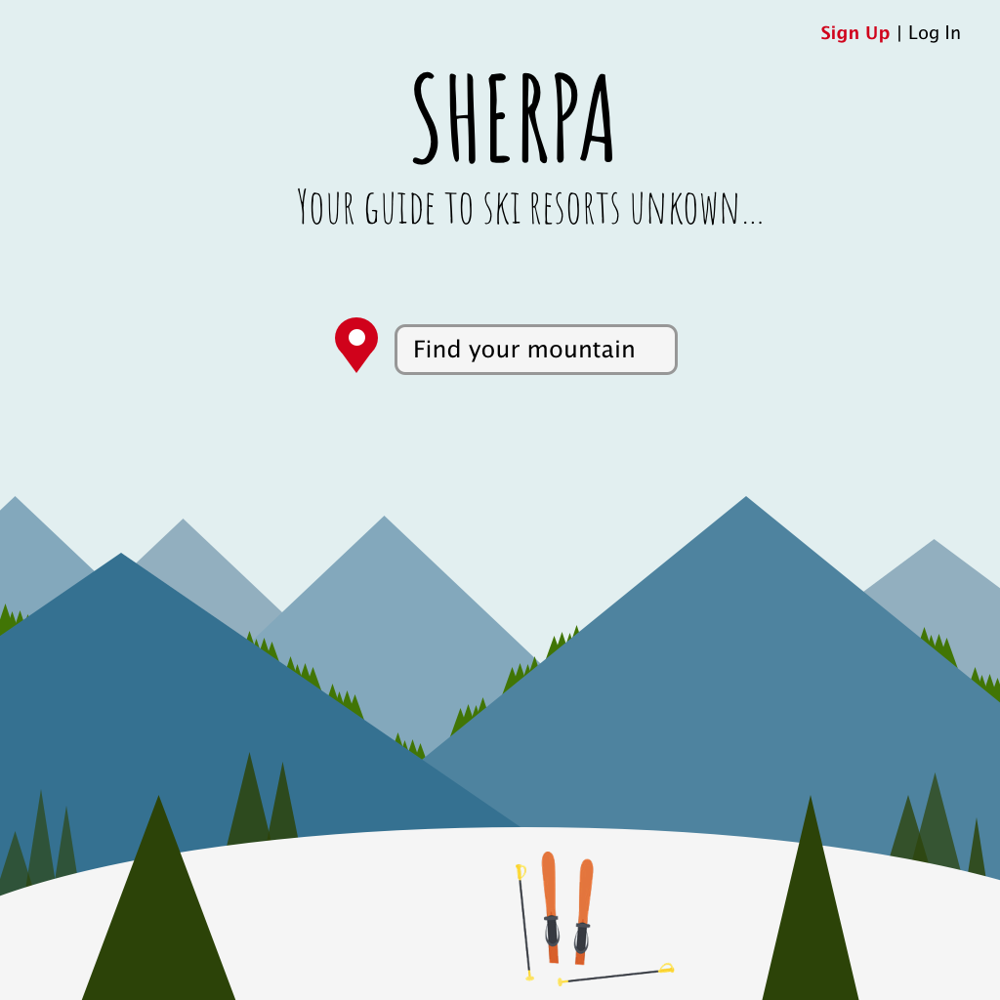

# Sherpa

#### Epicodus capstone project, 11.30.18

#### By Brendan Shea

## Project Description

**Project’s Purpose or Goal:** This app is for skiers, snowboarders, and anyone else who enjoys spending time in the mountains. Sherpa allows users to search for ski resorts in a specific area and find resorts based on that search. The user will then be able to learn everything they need to know about that resort before they spend money on airfare and lift tickets.

**List the absolute minimum features the project requires to meet this purpose or goal:**

* Search functionality that speaks with a database of ski resorts.
* Shows a list of information about the ski resort based on the search result (i.e. lift ticket prices, lodging prices, resort maps, etc.).
* Show current weather conditions for that area (i.e. temperature, projected temperature, snowpack, etc.).

**What tools, frameworks, libraries, APIs, modules and/or other resources (whatever is specific to your track, and your language) will you use to create this MVP? List them all here. Be specific.**

* React
* Redux
* OpenSnow API

**If you finish developing the minimum viable product (MVP) with time to spare, what will you work on next? Describe these features here: Be specific.**

* Ability to buy plane tickets to the nearest airport.
* Show the plotted ski resorts on map (most likely Leaflet).

**What additional tools, frameworks, libraries, APIs, or other resources will these additional features require?**

* Leaflet
* Google Flights

## Creative Process

#### Hand Drawn Sketches:

#### Sketch Mock-ups:

## Construction

## Install Instructions

#### From your desktop directory:

* `git clone https://github.com/bjrshea/sherpa.git`
* `cd folder_name`
* `npm install`
* `npm run start`

## Contribution Requirements

## Technologies Used

### Languages, libraries, & frameworks:

* Git
* HTML
* Sass
* JavaScript
* React
* Redux

### APIs:

* OpenWeatherMap
* OpenSnow
* Firebase

### Other tools:

* Sketch

## Links
